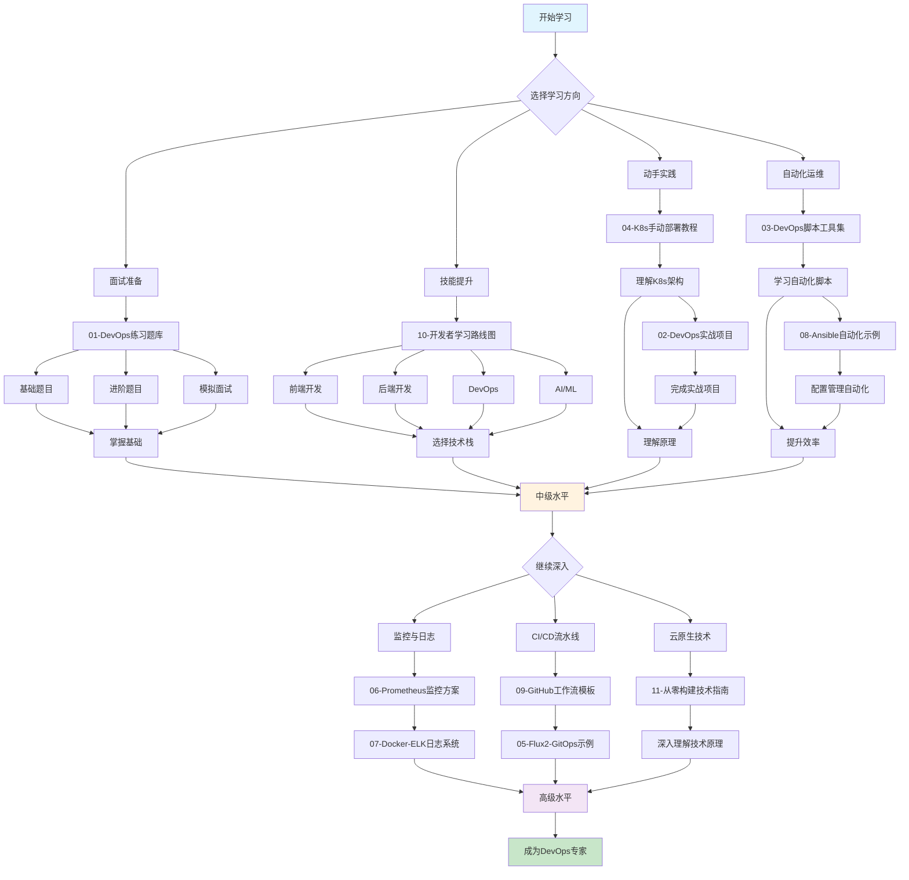

# DevOps 学习中心

一个全面的 DevOps 学习资源库，整合了 11 个精选的开源项目，为 DevOps 工程师、SRE 和云原生从业者提供一站式学习平台。

## ✨ 特性

- 📚 **2,600+ 道练习题** - 涵盖 Linux、Docker、Kubernetes、AWS 等 42 个技术主题
- 🛠️ **40 个实战项目** - 从入门到高级的 DevOps 项目
- 📜 **1,000+ 个脚本** - 覆盖云平台、CI/CD、数据库、监控等自动化场景
- 🎯 **交互式路线图** - 前端、后端、DevOps、AI 等方向的学习路径
- 🌐 **中文支持** - 所有文件均配有中文注释和说明

## 📁 包含项目

| 项目 | 内容 | 文件数量 |
|------|------|---------|
| [01-DevOps练习题库](./01-DevOps练习题库/) | 2,600+ 道面试题和练习 | 2,500+ |
| [02-DevOps实战项目](./02-DevOps实战项目/) | 40 个真实项目案例 | 1,200+ |
| [03-DevOps脚本工具集](./03-DevOps脚本工具集/) | 1,000+ 个自动化脚本 | 1,000+ |
| [04-K8s手动部署教程](./04-K8s手动部署教程/) | 从零搭建 Kubernetes 集群 | 100+ |
| [05-Flux2-GitOps示例](./05-Flux2-GitOps示例/) | GitOps 风格的集群管理 | 50+ |
| [06-Prometheus监控方案](./06-Prometheus监控方案/) | 完整的监控栈部署 | 100+ |
| [07-Docker-ELK日志系统](./07-Docker-ELK日志系统/) | 日志收集分析平台 | 150+ |
| [08-Ansible自动化示例](./08-Ansible自动化示例/) | 配置管理自动化 | 300+ |
| [09-GitHub工作流模板](./09-GitHub工作流模板/) | CI/CD 工作流模板 | 200+ |
| [10-开发者学习路线图](./10-开发者学习路线图/) | 交互式学习路径 | 5,000+ |
| [11-从零构建技术指南](./11-从零构建技术指南/) | 28 类技术项目教程 | 50+ |

## 🚀 快速开始

### 克隆仓库

```bash
git clone git@github.com:lin327/DevOps-Learning-Hub.git
cd DevOps-Learning-Hub
```

### 选择学习路径

1. **面试准备**: 查看 [01-DevOps练习题库](./01-DevOps练习题库/)
2. **技能提升**: 按 [10-开发者学习路线图](./10-开发者学习路线图/) 规划学习
3. **动手实践**: 从 [04-K8s手动部署教程](./04-K8s手动部署教程/) 开始
4. **自动化运维**: 学习 [03-DevOps脚本工具集](./03-DevOps脚本工具集/) 和 [08-Ansible自动化示例](./08-Ansible自动化示例/)

## 🎯 适合人群

- DevOps 工程师
- SRE（站点可靠性工程师）
- 云原生开发者
- 运维工程师
- 准备面试的求职者

## 📚 学习建议

### 初学者

1. 从 [01-DevOps练习题库](./01-DevOps练习题库/) 的基础题目开始
2. 学习 [04-K8s手动部署教程](./04-K8s手动部署教程/) 理解 Kubernetes 原理
3. 尝试 [02-DevOps实战项目](./02-DevOps实战项目/) 中的入门项目

### 中级

1. 完成 [01-DevOps练习题库](./01-DevOps练习题库/) 的进阶题目
2. 学习 [03-DevOps脚本工具集](./03-DevOps脚本工具集/) 中的自动化脚本
3. 实践 [08-Ansible自动化示例](./08-Ansible自动化示例/) 中的配置管理

### 高级

1. 挑战 [02-DevOps实战项目](./02-DevOps实战项目/) 中的高级项目
2. 学习 [05-Flux2-GitOps示例](./05-Flux2-GitOps示例/) 中的 GitOps 实践
3. 部署 [06-Prometheus监控方案](./06-Prometheus监控方案/) 和 [07-Docker-ELK日志系统](./07-Docker-ELK日志系统/)

## 📊 学习流程图



## 🔧 技术栈

- **容器化**: Docker, Kubernetes
- **CI/CD**: GitHub Actions, Jenkins, GitLab CI
- **监控**: Prometheus, Grafana, ELK Stack
- **自动化**: Ansible, Terraform
- **云平台**: AWS, Azure, GCP

## 📖 文档

- 每个项目目录下都有详细的 README 文件
- 所有文件均配有中文注释版本（`*_zh.md` 或 `*_zh.sh`）
- 项目说明文档: [项目说明.md](./项目说明.md)

## 🤝 贡献

欢迎提交 Pull Request 添加更多学习资源！

## 📄 许可证

本项目包含多个开源项目，请查看各项目目录下的 LICENSE 文件了解具体许可协议。

## 🔗 相关链接

- [GitHub 仓库](https://github.com/lin327/DevOps-Learning-Hub)
- [项目说明](./项目说明.md)

---

**开始你的 DevOps 学习之旅吧！** 🚀
